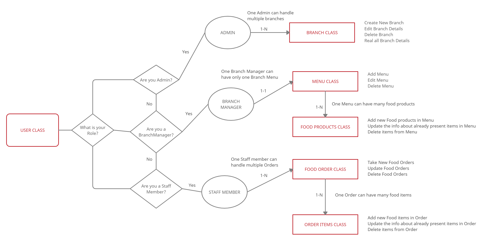

# Food Ordering Application

The food industry is up and booming again with the support of technology. There is a massive development of technology which aids the restaurants and food delivery businesses alike.Online food ordering is the process of food delivery or takeout from a local restaurants or food cooperative through a web page or app.

## Diagram for the Application

    

